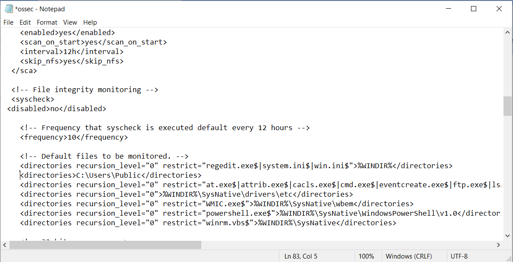
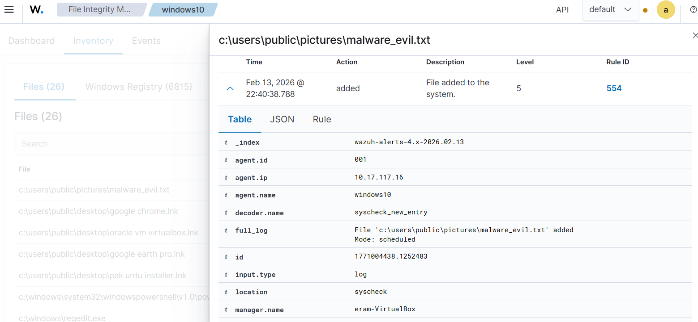

# Real-Time File Integrity Monitoring (FIM) & Threat Triage via Wazuh SIEM

## 1. Project Overview & Objective
Configured an active File Integrity Monitoring (FIM) telemetry pipeline using Wazuh SIEM to detect unauthorized file creations and suspicious ingress artifacts on a Windows enterprise endpoint. This lab demonstrates real-time zero-trust validation and incident triage.

## 2. Environment Architecture & Parameters
* **SIEM Engine:** Wazuh Manager (Ubuntu Server / `eram-VirtualBox`)
* **Monitored Node:** Windows 10 Endpoint (`Agent ID: 001`, IP: `10.17.117.16`)
* **Detection Mechanism:** Wazuh Syscheck FIM Module
* **MITRE ATT&CK Mapping:** 
  * Tactic: Persistence (TA0003) / Defense Evasion (TA0005)
  * Technique: Ingress Tool Transfer (T1105)


## 3. Engineering Implementation





### A. FIM Rule Deployment (`ossec.conf`)
Configured granular directory monitoring on public and high-risk paths with real-time tracking enabled:
```xml
<!-- File integrity monitoring configuration -->
<syscheck>
  <disabled>no</disabled>
  <frequency>10</frequency>
  <directories>C:\Users\Public</directories>
</syscheck>
(Monitored system binaries including regedit.exe, powershell.exe, and public user directories).

```


## 4. Threat Simulation & Forensic Triage

### A. Ingress Simulation
Simulated an unauthorized payload drop by placing an unverified artifact into the monitored path:  
`c:\users\public\pictures\malware_evil.txt`

### B. Telemetry & Alert Analysis
The Wazuh FIM engine captured the event and triggered a Level 5 alert:
* **Rule ID:** 554 (File added to the system)
* **Decoder:** syscheck_new_entry
* **Target Node:** windows10 (10.17.117.16)
* **User SID / Actor:** techm (S-1-5-21-347...)





## 5. Incident Response Playbook (SOC Tier-1 Triage)

* **Incident ID:** INC-2026-FIM-554
* **Alert Description:** Rule 554 - File added to monitored public directory
* **Affected Asset:** windows10 (Agent 001 / 10.17.117.16)
* **Investigative Findings:** File `malware_evil.txt` dropped in public pictures directory by user `techm`. SHA256 baseline created in FIM inventory.
* **Remediation Action:** Artifact contained for sandbox hash analysis; user activity audited for lateral movement.

---

## 6. Key Competencies Validated
* SIEM Architecture & Granular Configuration (Wazuh `ossec.conf`)
* Real-time Endpoint Telemetry & FIM Triage
* Identity & User SID Correlation (`techm`)
* Incident Response Documentation & Playbook Execution


Target Node: windows10 (10.17.117.16)

User SID / Actor: techm (S-1-5-21-347...)
